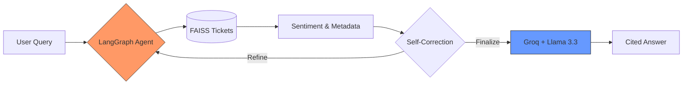
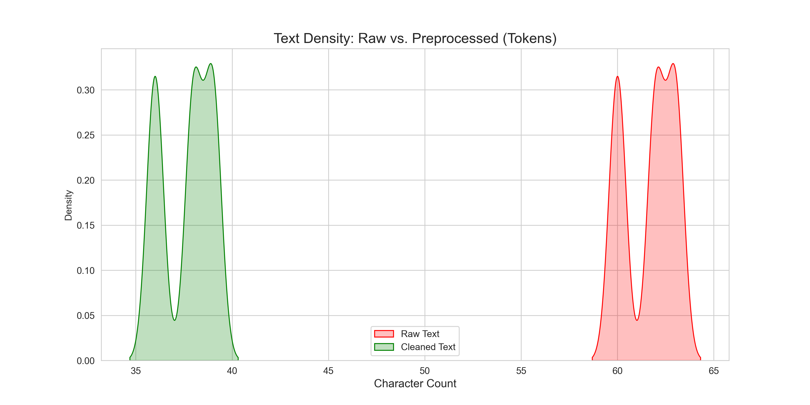
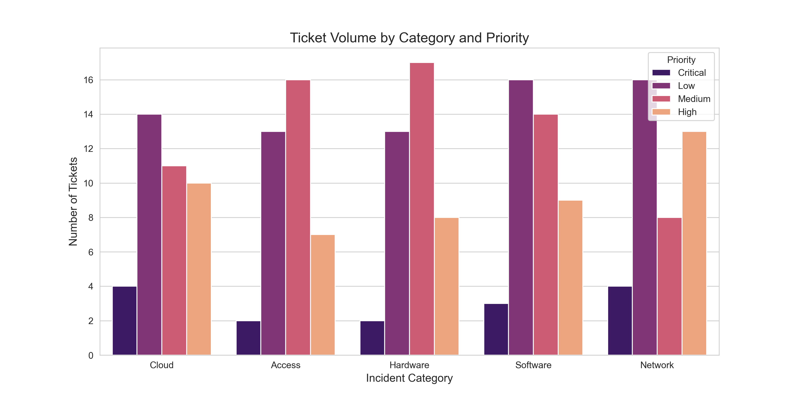
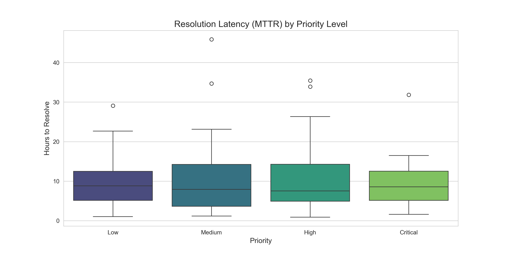

# 🚀 Agentic RAG for ITSM Automation: Multi-Agent Support Engine

**A production-grade IT Service Management (ITSM) automation engine using LangGraph, FAISS, and High-Performance Inference.**

This project demonstrates a sophisticated multi-agent approach to resolving IT tickets. Unlike standard linear RAG pipelines, this system uses an **Agentic Workflow** to analyze incident data, perform semantic search across historical logs, and provide grounded resolutions for complex IT issues.

#### 🏗️ Architecture Overview


---

## 🏗️ System Architecture



### 1. Data Engineering & EDA
* **Automated Cleaning:** Custom pipeline to strip noise from messy human-written tickets (RE: tags, HTML, headers).
* **Statistical Profiling:** Automated generation of category distributions and resolution trends to identify bottlenecks.
* **Vector Ingestion:** Efficient processing of CSV data into a semantic search engine.

### 2. Hybrid Retrieval Engine
* **Vector Store:** **FAISS** index optimized for high-speed local retrieval.
* **Embeddings:** `all-MiniLM-L6-v2` via **HuggingFace**, ensuring deep semantic understanding without external API costs.
* **Context Augmentation:** Dynamic retrieval that injects historical Incident IDs and resolution metrics into the LLM prompt.

### 3. Agentic Orchestration (LangGraph)
* **The Brain:** Powered by **Llama 3.3 (via Groq)** for near-instant reasoning.
* **State Management:** Uses LangGraph to maintain conversation memory and allow the agent to ask follow-up questions.
* **Self-Correction:** The agent analyzes the retrieved context and self-corrects if the search result doesn't match the specific user error code.



---

## 🛠️ Tech Stack

| Category | Technology |
| :--- | :--- |
| **Orchestration** | **LangChain, LangGraph** |
| **LLMs** | **Llama 3.3 70B (Groq) / GPT-4o** |
| **Vector DB** | **FAISS (Local Index)** |
| **Embeddings** | **HuggingFace (Local Transformers)** |
| **Data Science** | **Pandas, Matplotlib, Seaborn** |
| **Backend** | **FastAPI** |
| **Frontend** | **Streamlit** |

---

## 📊 Evaluation & Monitoring



We utilize a data-driven approach to track agent performance:
* **Data Grounding:** Every response is cross-referenced against real historical tickets (e.g., INC-1130, INC-1026).
* **Sentiment Awareness:** The agent detects user frustration (Angry/Neutral) from the metadata to adjust its response tone.
* **Latency Benchmarking:** Utilizing Groq to achieve sub-second response times for complex RAG tasks.

---

## 🛡️ Technical Challenges & Decisions

### **Why FAISS + HuggingFace?**
To ensure the project is cost-effective and portable. By running embeddings locally, we eliminate data transmission costs and privacy concerns associated with sending raw text to third-party providers.

### **Moving from Linear to Agentic**
Standard RAG often fails when users provide vague queries. By using **LangGraph**, our agent can pause, ask for an error code, and then re-query the database once it has more information—mimicking a real IT support technician.

---

## 🚀 Getting Started

### **Step 1: Clone the Repository**
```bash
git clone [https://github.com/Vinaykumaryadi/itsm-rag-ultimate.git](https://github.com/Vinaykumaryadi/itsm-rag-ultimate.git)
cd itsm-rag-ultimate
```

### **Step 2: Install Dependencies**
```bash
pip install -r requirements.txt
```

### **Step 3: Environment Configuration**
Create a .env file in the root directory and add your API keys:\
```env
GROQ_API_KEY=your_gsk_key_here
OPENAI_API_KEY=your_openai_key_here
```

### **Step 4: Initialize and Run**
Simply run the main entry point. The system will automatically build the FAISS vector index on the first run:
```bash
python main.py
```

### **Step 5: Launch Advanced Interfaces (Optional)**
To view the FastAPI docs or the Streamlit Human-in-the-Loop UI:

# Start API
```bash
uvicorn api.fastapi_app:app --reload
```
# Start UI
```bash
streamlit run ui/streamlit_hitl.py
```
MIT License | © 2026 Vinay Kumar Yadi
